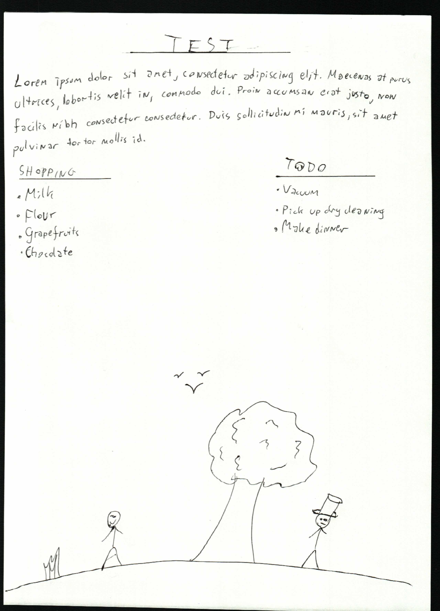
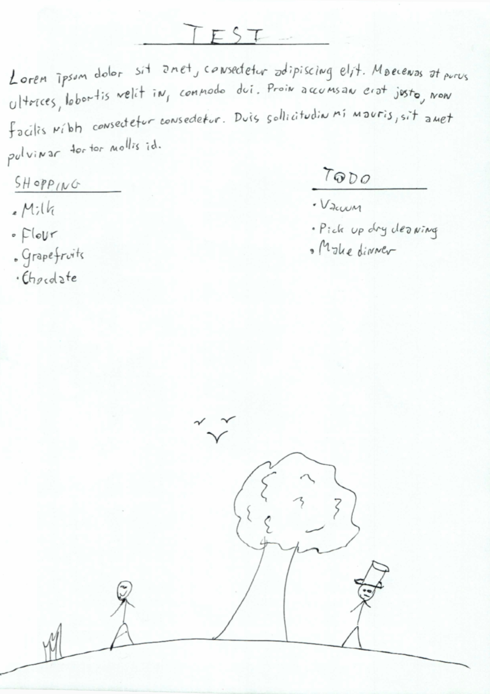

# Scanfix <!-- omit in toc -->
This is a relatively simple project, fixing images from a scanner.

I have a handheld scanner, which works quite well but it doesn't automatically detect the scanned page, so that the resulting images always have background on all or almost all sides. So I made this, which fixes these problems and also creates a .pdf file from the images.

# Table of contents <!-- omit in toc -->
- [Installation](#installation)
- [How does it work?](#how-does-it-work)
  - [Processing path](#processing-path)
  - [Using custom images](#using-custom-images)
- [Config parameters](#config-parameters)
  - [Processing path](#processing-path-1)
  - [Image I/O](#image-io)
- [Will this work on Linux?](#will-this-work-on-linux)
- [Notes](#notes)

# Installation
This project is meant to be run in python3. In addition to that, you need to install the [requirements](requirements.txt):
```
pip install -r requirements.txt
```

# How does it work?
Images are loaded from the given device (or just directory), processed and saved. The processing path is described in more detail in [section 2.1](#processing-path). Below you can see an example image directly from the scanner and after it's been processed.

Raw image:
<p align="center">
    
</p>

As you can see, there is quite a lot of unnecessary background around the image, which also happens to be in high contrast with the scanned page. After removing all of that, the image looks like this:
<p align="center">
    
</p>


## Processing path
The images are processed as follows:
1. Image is blurred, in order to reduce noise and soften edges
2. Image is converted to grayscale and thresholded, so that background is separated from the actual page
3. The largest area [contour](https://docs.opencv.org/3.4/d4/d73/tutorial_py_contours_begin.html) is separated as it is the most likely one to be the page
4. The bounding rectangle of this contour is calculated, and the image is cropped to fit only this rectangle
5. The background is set to a solid color
6. Optionally, the image is further cropped so that even more of the background is removed.


## Using custom images
Feel free to try it out on your own images! Just remember to stick to the name format:
```
[PREFIX][INDEX].[EXTENSION]
```
You can adjust the prefix and extenstion in `cfg/config.yml`. Also, setting
```yaml
DEVICE_PATH: images\
```
will process the example image. You can use that as benchmark against this version of the image, processed (above).

# Config parameters
Everything you need to change is in [the config file](cfg/config.yml). All the parameters are described below

## Processing path
Param | Type | Description
--- | --- | ---
`BACKGROUND_COLOR` | `uint8` or `[uint8, uint8, uint8]` or `null` | Color of the new background to draw over the old one. Setting `null` will leave the color to be determined automatically
`BLUR_KERNEL` | `int` or `[int, int]` | Kernel size to use for blurring. Setting 0 will disable blurring
`EROSION_ITERATIONS` | `int` | Number of times to perform erosion on the page mask
`EROSION_KERNEL` | `int` or `[int, int]` | Kernel or kernel size to use for erosion
`MARGIN` | `int` | Margin in pixels to cut off from each side. 0 will disable this
`THRESHOLD` | `uint8` | Threshol value to use
`THRESH_INVERTED` | `bool` | Whether to invert thresholding. This is only useful if your background is brighter than your page

## Image I/O
Param | Type | Description
--- | --- | ---
`DEVICE_PATH` | `string` | Directory path to read in images from
`IMAGE_EXTENSION` | `string` | File extension to load. Only files with this extension will be loaded
`IMAGE_PREFIX` | `string` | Image prefix of files. In my case, this depends on the scanner I'm using
`LAST_IMAGE_IDX` | `int` | Index of last image processed. This will be updated automatically in order to ensure that a new pdf created automatically does not include old scans
`READ_GRAYSCALE` | `bool` | Whether to read in images as grayscale. This will also cause images to be saved as grayscale
`SAVE_DPI` | `int` | The output images will correspond to an A4 page with this DPI
`SAVE_FORMAT` | `string` | File extension to save as. Either `pdf` or an image extension (leave out the leading `.`)
`SAVE_PATH` | `string` | Directory path to save output in. Will be created if it does not exist
`SAVE_PREFIX` | `string` | Additional prefix to save with


# Will this work on Linux?
Yes, the only thing you might need to do is replace backslashes (`\`) with slashes (`/`) in [the config file](cfg/config.yml).

# Notes
- The pages I tested this on were all standard A4 size
- They were scanned on a black, flat surface